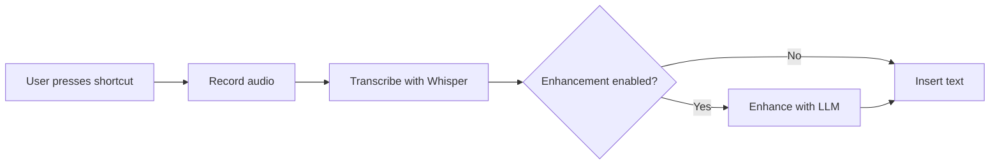
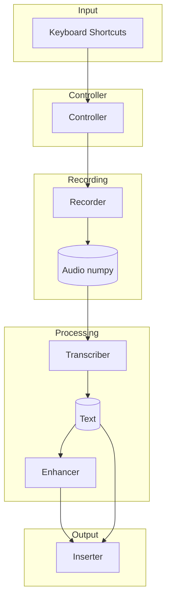
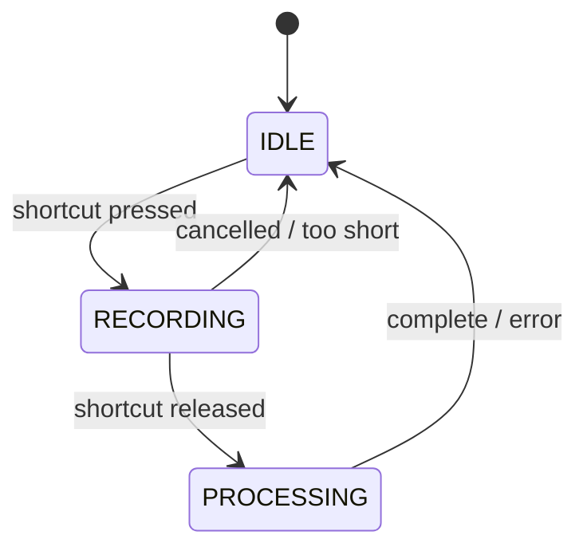

# WhOSSpr Flow Architecture

This document describes the architecture of WhOSSpr Flow, an open-source speech-to-text application for macOS.

## Overview

WhOSSpr Flow captures audio from the microphone, transcribes it using OpenAI Whisper, optionally enhances the text with an LLM, and inserts the result into the active application.

## Module Structure

| Module | Lines | Description |
|--------|-------|-------------|
| `cli.py` | 284 | Command-line interface (Typer) |
| `controller.py` | 255 | Main orchestration logic |
| `enhancer.py` | 206 | LLM text enhancement (OpenAI API) |
| `config.py` | 180 | Configuration schema and loading |
| `keyboard.py` | 173 | Global keyboard shortcuts (pynput) |
| `transcriber.py` | 116 | Speech-to-text (Whisper) |
| `recorder.py` | 115 | Audio recording (sounddevice) |
| `permissions.py` | 58 | macOS permission checks |
| `inserter.py` | 53 | Text insertion via clipboard |
| `__init__.py` | 4 | Package version |
| **Total** | **1444** | |

## Module Responsibilities

| Module | Responsibility |
|--------|---------------|
| `cli.py` | Argument parsing, config loading, permission checks, service lifecycle, Rich console feedback |
| `config.py` | Type-safe Pydantic schema, JSON loading/saving, defaults, config file discovery |
| `controller.py` | State management (IDLE→RECORDING→PROCESSING), shortcut-to-recording connection, transcription pipeline |
| `recorder.py` | Callback-based non-blocking recording, 16kHz float32 audio, start/stop/cancel, duration tracking |
| `transcriber.py` | Lazy model loading, device auto-detection (CUDA/MPS/CPU), model size support, memory management |
| `keyboard.py` | Shortcut parsing ("ctrl+cmd+1"), hold/toggle modes, modifier normalization, callback invocation |
| `inserter.py` | Copy to clipboard, paste with Cmd+V, universal application support |
| `enhancer.py` | OpenAI-compatible API, API key resolution, custom prompts, grammar/punctuation improvement |
| `permissions.py` | Microphone access check, accessibility access check, pass/fail status |

## Data Flow

## State Machine

## Design Principles

| Principle | Description |
|-----------|-------------|
| Simple Modules | Each module has single responsibility, none exceeds ~300 lines |
| Sequential Processing | Record→transcribe→enhance→insert runs sequentially (user waits anyway) |
| Loose Coupling | Controller imports others; other modules don't import each other (except config) |
| Direct Initialization | Components created when needed, no lazy patterns or factories |
| Callbacks for UI | Controller uses on_state/on_text/on_error callbacks to separate UI from logic |

## Threading Model

| Component | Threading |
|-----------|-----------|
| sounddevice | Handles audio callback internally |
| pynput | Runs keyboard listener in separate thread |
| Processing | Sequential - no background threads for transcription |

This simplifies debugging and reduces race conditions.

## Configuration Schema

| Section | Field | Type | Default |
|---------|-------|------|---------|
| `whisper` | `model_size` | ModelSize | `base` |
| `whisper` | `language` | str | `en` |
| `whisper` | `device` | DeviceType | `auto` |
| `shortcuts` | `hold_to_dictate` | str | `ctrl+cmd+1` |
| `shortcuts` | `toggle_dictation` | str | `ctrl+cmd+2` |
| `enhancement` | `enabled` | bool | `false` |
| `enhancement` | `api_key` | str | `""` |
| `enhancement` | `model` | str | `gpt-4o-mini` |
| `audio` | `sample_rate` | int | `16000` |
| `audio` | `channels` | int | `1` |

## Test Structure

| Test File | Coverage |
|-----------|----------|
| `test_config.py` | Config loading/saving |
| `test_recorder.py` | Audio recording |
| `test_transcriber.py` | Whisper wrapper |
| `test_keyboard.py` | Shortcut parsing/handling |
| `test_controller.py` | Orchestration logic |
| `test_enhancer.py` | LLM enhancement |
| `test_cli.py` | CLI commands |
| `test_e2e_manual.py` | Interactive tests (require user) |

## Dependencies

| Package | Purpose |
|---------|---------|
| sounddevice | Audio recording (no portaudio headers needed) |
| openai-whisper | Local speech-to-text |
| pynput | Global keyboard shortcuts |
| pyperclip | Clipboard operations |
| typer + rich | CLI framework |
| pydantic | Configuration validation |
| openai | LLM API client |
