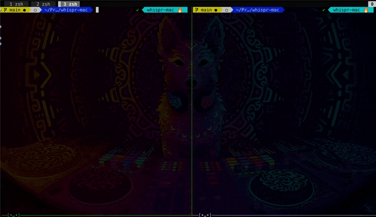

# WhOSSpr Flow

An Open Source WhisprFlow Clone Speech-to-Text for macOS; eupports press to speak, toggle dictation, local inference, and configurable enhancement with OpenAI compatible models.



## Installation

```bash
pip install whosspr
```

## Quick Start

```bash
# Start service and use keyboard shortcuts (below) to speak
> whosspr start

11:25:20 [INFO] whosspr.cli: WhOSSpr Flow v0.1.0 starting...
11:25:20 [INFO] whosspr.config: No config file found, using defaults
╭───── Starting ──────╮
│ WhOSSpr Flow v0.1.0 │
│                     │
│ Model: base         │
│ Language: en        │
│ Device: auto        │
│ Enhancement: off    │
│                     │
│ Hold: ctrl+cmd+1    │
│ Toggle: ctrl+cmd+2  │
╰─────────────────────╯

Press Ctrl+C to stop.

11:25:20 [INFO] whosspr.controller: Loading Whisper model...
11:25:20 [INFO] whosspr.transcriber: Loading Whisper model 'base' on mps
11:25:22 [INFO] whosspr.transcriber: Model loaded
11:25:22 [INFO] whosspr.keyboard: Registered shortcut: ctrl+cmd+1 (hold)
11:25:22 [INFO] whosspr.keyboard: Registered shortcut: ctrl+cmd+2 (toggle)
11:25:22 [INFO] whosspr.keyboard: Keyboard listener started
11:25:22 [INFO] whosspr.controller: Dictation service started
```

## Default Shortcuts

| Shortcut | Action |
|----------|--------|
| `Ctrl+Cmd+1` (hold) | Hold to record, release to transcribe |
| `Ctrl+Cmd+2` | Toggle dictation on/off |

## Permissions Setup

WhOSSpr requires two macOS permissions:

| Permission | Purpose | How to Grant |
|------------|---------|--------------|
| Microphone | Record audio | System Preferences → Privacy → Microphone → Enable Terminal |
| Accessibility | Insert text | System Preferences → Privacy → Accessibility → Add Terminal |

Verify with:
```bash
whosspr check
```

## Features

| Feature | Description |
|---------|-------------|
| Local Whisper transcription | Uses OpenAI Whisper models locally for privacy |
| Configurable model sizes | Choose from tiny, base, small, medium, or large models |
| Keyboard shortcuts | Hold-to-dictate or toggle dictation modes |
| Universal text injection | Works with any application (browsers, terminals, editors) |
| Optional LLM enhancement | Improve transcribed text with OpenAI-compatible APIs |
| JSON configuration | Easy setup via config files or command-line parameters |

## Configuration

Initialise config with:

```bash
# Create a new config
whosspr config --init

# Run with config
whosspr start --config ./whosspr.json
```

You will get 

```json
{
  "whisper": {
    "model_size": "base",
    "language": "en",
    "device": "auto",
    "model_cache_dir": null
  },
  "shortcuts": {
    "hold_to_dictate": "ctrl+cmd+1",
    "toggle_dictation": "ctrl+cmd+2"
  },
  "enhancement": {
    "enabled": false,
    "api_base_url": "https://api.openai.com/v1",
    "api_key": "",
    "api_key_helper": null,
    "api_key_env_var": null,
    "model": "gpt-4o-mini",
    "system_prompt_file": "prompts/default_enhancement.txt",
    "custom_system_prompt": null
  },
  "audio": {
    "sample_rate": 16000,
    "channels": 1,
    "min_duration": 0.5,
    "prepend_space": true
  },
  "tmp_dir": "./tmp",
  "log_level": "INFO"
}
```

## Whisper Model Sizes

| Model | Size | Speed | Accuracy | VRAM |
|-------|------|-------|----------|------|
| tiny | 39M | Fastest | Basic | ~1GB |
| base | 74M | Fast | Good | ~1GB |
| small | 244M | Medium | Better | ~2GB |
| medium | 769M | Slow | Great | ~5GB |
| large | 1.5B | Slowest | Best | ~10GB |
| turbo | 809M | Fast | High | ~6GB |

**Recommendation:** Start with `base` for a balance of speed and accuracy.

## Requirements

| Requirement | Details |
|-------------|---------|
| OS | macOS 10.14+ (optimized for Apple Silicon) |
| Python | 3.12+ |
| Permissions | Microphone access, Accessibility access |
| RAM | 2GB+ (more for larger models) |

## Usage

### Starting the Service

```bash
whosspr start
```

### Command-line Options

| Option | Description |
|--------|-------------|
| `--model` | Whisper model size (tiny/base/small/medium/large/turbo) |
| `--language` | Language code (e.g., en, es, fr) |
| `--device` | Device for inference (auto/cpu/mps/cuda) |
| `--enhancement` | Enable LLM text enhancement |
| `--api-key` | API key for enhancement |

### Examples

```bash
# Use small model with Spanish
whosspr start --model small --language es

# Use MPS (Apple Silicon GPU)
whosspr start --device mps

# Enable enhancement
whosspr start --enhancement --api-key sk-xxx
```

## Text Enhancement

WhOSSpr can improve transcribed text using an OpenAI-compatible API:

```bash
# Using OpenAI
export OPENAI_API_KEY=sk-your-api-key
whosspr start --enhancement

# Using local LLM (Ollama)
whosspr start --enhancement \
  --api-key ollama \
  --api-base-url http://localhost:11434/v1
```

## Troubleshooting

| Problem | Solution |
|---------|----------|
| Permission denied | Run `whosspr check`, grant permissions, restart terminal |
| No audio input | Check microphone connection and permissions |
| Text not appearing | Verify Accessibility permission, try different app |
| Model download fails | Check internet, try `--model tiny` |
| High CPU/memory | Use smaller model, try `--device mps` on Apple Silicon |

## Development

### Install from Source

```bash
git clone https://github.com/axsaucedo/WhOSSprFlow.git
cd WhOSSprFlow
pip install -e ".[dev]"
```

### Running Tests

```bash
# All automated tests
pytest

# With coverage
pytest --cov=whosspr

# Manual E2E tests (interactive)
WHOSSPR_MANUAL_TESTS=1 pytest tests/test_e2e_manual.py -v -s
```

### Project Structure

| Directory/File | Purpose |
|----------------|---------|
| `whosspr/` | Main package |
| `whosspr/cli.py` | CLI interface |
| `whosspr/controller.py` | Main orchestration |
| `whosspr/recorder.py` | Audio recording |
| `whosspr/transcriber.py` | Whisper integration |
| `whosspr/keyboard.py` | Shortcut handling |
| `whosspr/inserter.py` | Text insertion |
| `whosspr/enhancer.py` | LLM enhancement |
| `whosspr/config.py` | Configuration |
| `whosspr/permissions.py` | Permission checks |
| `tests/` | Test suite |
| `prompts/` | Enhancement prompts |

### Key Dependencies

| Package | Purpose |
|---------|---------|
| sounddevice | Audio recording |
| openai-whisper | Speech-to-text |
| pynput | Keyboard shortcuts |
| pyperclip | Clipboard operations |
| typer | CLI framework |

## License

Apache 2.0
